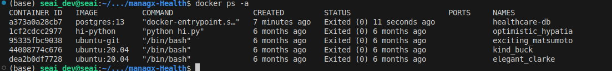
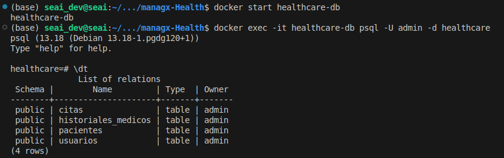
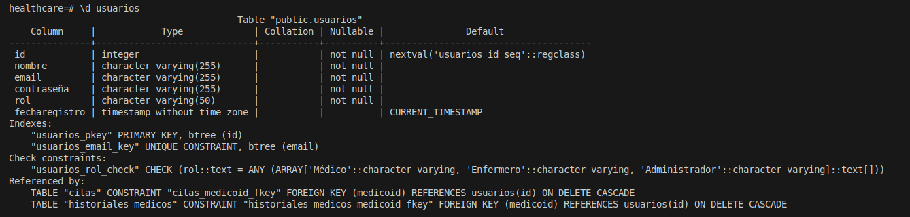
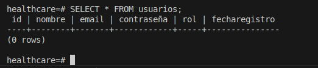

# Diseño e implementacion de la base de datos

Este documento guía en la implementación de una base de datos PostgreSQL para un proyecto local utilizando:
- **Docker Compose** para contenerización.
- **node-pg-migrate** para gestionar migraciones.

## Diseño e implementación de la base de datos

- **Gestor de base de datos:** Utilizar PostgreSQL por su robustez y capacidades avanzadas en manejo de datos relacionales.

* **Modelado de datos simplificado:**
  * **Usuarios:**
    
    * `id`: Identificador único.
    * `nombre`: Nombre completo.
    * `email`: Correo electrónico único.
    * `contraseña`: Contraseña cifrada.
    * `rol`: Rol del usuario (Médico, Enfermero, Administrador).
    * `fechaRegistro`: Fecha de creación de la cuenta.

  * **Pacientes:**
        
    * `id`: Identificador único. 
    * `nombre`: Nombre completo.
    * `fechaNacimiento`: Fecha de nacimiento.
    * `direccion`: Dirección residencial.
    * `telefono`: Número de teléfono.
    * `email`: Correo electrónico.
    * `historialMedico`: Relación con historiales médicos.
  * **Historiales médicos:**
    * `id`: Identificador único.
    * `pacienteId`: Referencia al paciente.
    * `descripcion`: Descripción del historial.
    * `fecha`: Fecha del registro.
    * `medicoId`: Referencia al médico que creó el historial.

  * **Citas**:
    * `id`: Identificador único.
    * `pacienteId`: Referencia al paciente.
    * `medicoId`: Referencia al médico.
    * `fechaHora`: Fecha y hora de la cita.
    * `motivo`: Motivo de la cita.
    * `estado`: Estado de la cita (Programada, Completada, Cancelada).

## Configurar PostgreSQL
> **Importante**: 
> 
> He usado como recurso principal este articulo:
> [How to Use the Postgres Docker Official Image](https://www.docker.com/blog/how-to-use-the-postgres-docker-official-image/#Why-should-you-containerize-Postgres)


1. **Pre-requisitos**:
    - Docker: [Guía de instalación oficial](https://docs.docker.com/get-docker/)
    - Docker Compose: Incluido con Docker en versiones modernas.

2. **Verificar instalación**:
    > Tener en cuenta omitir `sudo` antes de cada comando. para ello revisar: [How to fix: Docker Permission Denied](https://www.linkedin.com/pulse/resolving-docker-permission-denied-error-guide-om-prakash-singh/)
  
    Ejecutar los siguientes comandos para asegurarte de que Docker y Docker Compose están instalados:
    ```bash
    docker --version
    docker compose version
    ```

---

3.  **Estructura del `docker-compose.yml`**

Crea un archivo `docker-compose.yml` en el directorio raíz del proyecto con la siguiente configuración:

```yml
version: "3.9"
services:
  db:
    image: postgres:13
    container_name: healthcare-db
    environment:
        POSTGRES_USER: ${POSTGRES_USER}
        POSTGRES_PASSWORD: ${POSTGRES_PASSWORD}
        POSTGRES_DB: ${POSTGRES_DB}
    ports:
      - "5432:5432"
    volumes:
      - db-data:/var/lib/postgresql/data
      - ./database/config:/docker-entrypoint-initdb.d
    restart: unless-stopped

volumes:
  db-data:
```
Este documento esta comentado a detalle en la ruta: [docker-compose.yml](../docker/docker-compose.yml)

4. Crear scripts de inicialización

Relacionado a como seria la base de datos inicial revisar la ruta de [init.sql](../database/config/init.sql)


## Inicializar base de datos
- Inicializar el servicio con [docker compose](https://medium.com/@asuarezaceves/initializing-a-postgresql-database-with-a-dataset-using-docker-compose-a-step-by-step-guide-3feebd5b1545)

    ```shell
    docker-compose up
    ```

    Este comando su funcion es: 
    - Crea y configura el contenedor de PostgreSQL.
    - Ejecuta cualquier archivo en database/config como parte de la inicialización.

    Deberias de observar la creacion de la base de datos y que esta a la escucha:

    


- Verificar el estado del contenedor

    ```shell
    docker ps
    ```

    Revisa las imagenes

    

- Accede a la consola de PostgreSQL dentro del contenedor
  
    ```shell
    docker exec -it healthcare-db psql -U admin -d healthcare

    ```

    Comporbamos la creaacion de nuestra base de datos
    - listar tablas
    
        

    - Ver estructura de una tabla (por ejemplo, usuarios):
    
        
    
    - Ejecutar una consulta (por ejemplo, listar usuarios):
    
        

    - salir de psql
        
        ```psql
        healthcare=# \q
        ```
